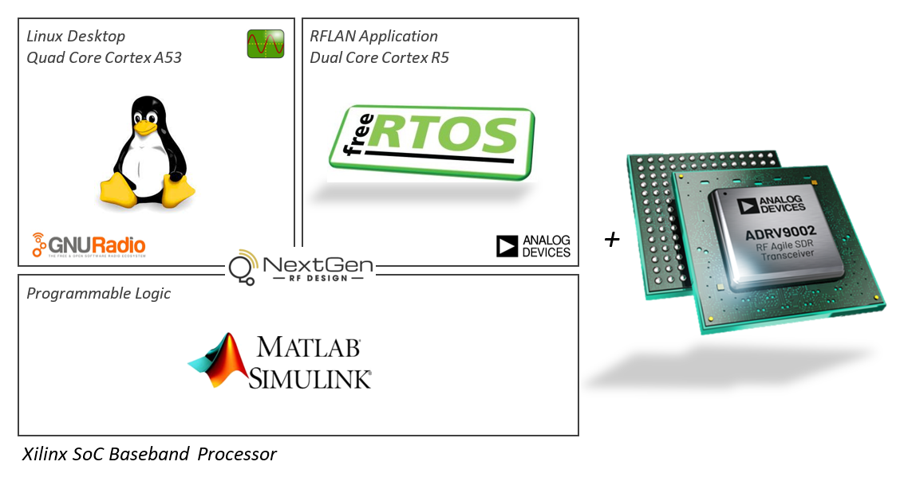
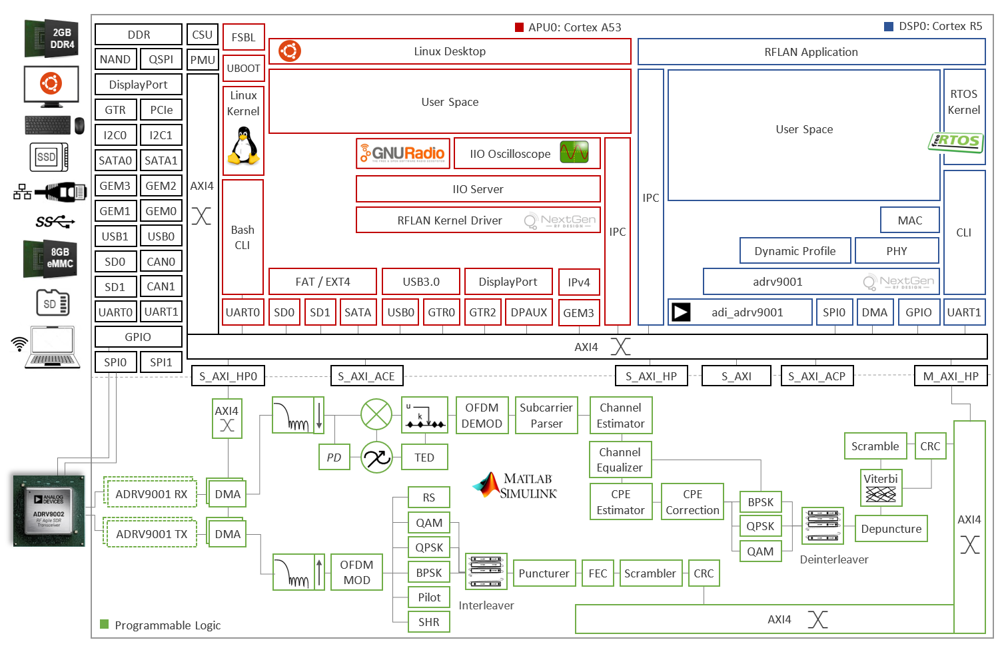
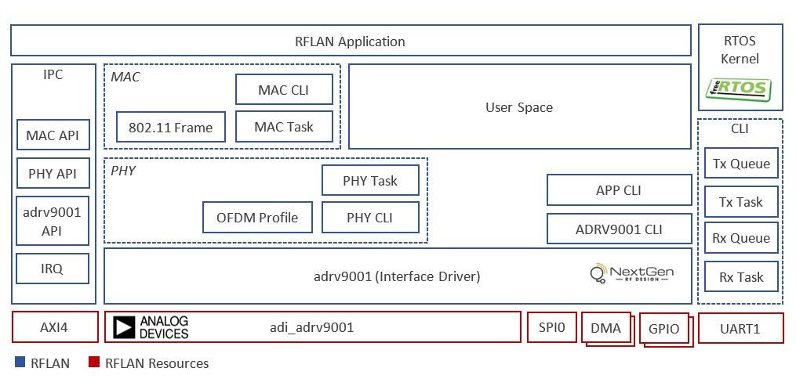
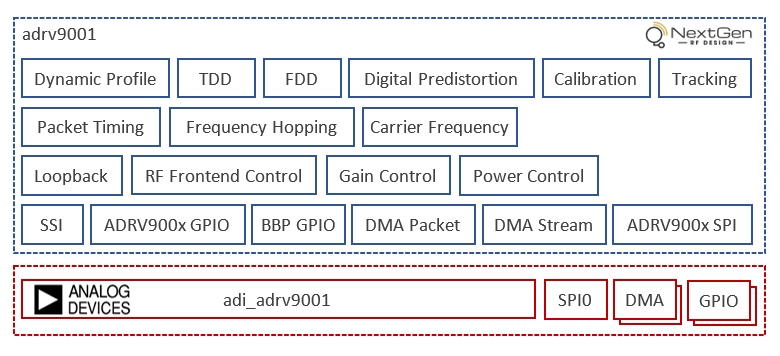
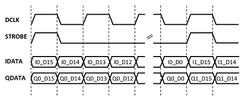
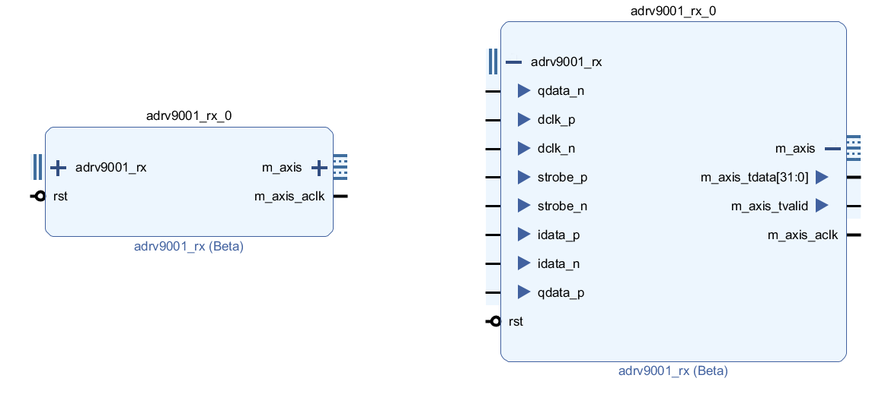
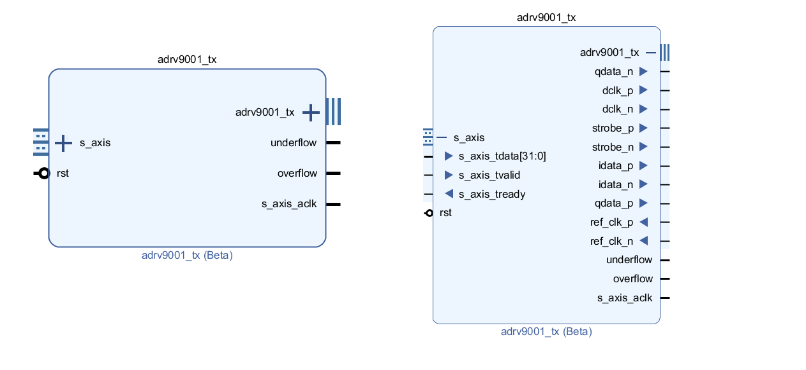

---

# BytePipe Software Development Kit

The BytePipe Software Development Kit (SDK) provides a framework for quickly evaluating the BytePipe hardware platform.  These software components are designed to provide users with a software framework to enable user development.  They also showcase just a few of the many examples that the BytePipe_x900x SOM can be used for.  The following is a high level block diagram of the software.  The software includes Linux Desktop running on one of the Cortex A53 application processors and the RFLAN FreeRTOS application running on one of the Cortex R5 DSP processors.  The programmable logic can be used to support a wide variety of RF communication protocols and includes MathWorks examples.  



# Software Stack

Starting at the top of the software stack are several application layer components.  These applications are divided across a single Cortex A53 CPU and a single Cortex R5 CPU.  The Cortex A53 processor runs a Linux Kernel while the Cortex R5 CPU runs a FreeRTOS kernel.  The Linux application space provides a convenient user interface including Ubuntu Desktop.  Users can connect directly to the SOM with a monitor, keyboard, and mouse and interact locally through Ubuntu Desktop or connect remotely using the Linux bash terminal. 

Alongside the Linux application space, the RF local area network (RFLAN) application provides low level access to the hardware peripherals and RF hardware.  This application can be run in parallel with the Linux framework or as a standalone application.  When run as a standalone application, the primary user interface is a command line interface (CLI) allowing for users to configure and control the RF hardware along with transmitting and receiving waveforms including enabling digital pre-distortion (DPD).  When the RFLAN is run in parallel with the Linux framework, all the same functionality is available through the command line of the RFLAN, but with the added benefit of additional Linux applications which connect to the RF hardware via the RFLAN.  Having a low-level standalone test application in combination with a full Linux desktop provides the best of both worlds supporting a high functioning user interface while providing low-level debug access to the RF hardware.

Below the application layer is a board support package (BSP) that includes all the low-level drivers for exercising the RF hardware and peripherals such as Ethernet, USB, display port, etc.  Included in the BSP is Analog Device’s adi_adrv9002 production device driver.  This driver is responsible for all configuration and control of the ADRV9002 RFIC.  This driver is integrated into NextGen RF Design’s adrv9002 interface driver which provides the hardware abstraction layer along with configuration and control of the data interface to the ADRV9002.  NextGen RF Design regularly updates and tests the latest adi_adrv9002 driver with each release of the BSP.   

Below the BSP layer is the hardware platform (HWP) layer.  This layer is generated from the output of the hardware description language (HDL) code in the programmable logic and contains the address definitions for all of the peripherals connected to the CPU.  This includes any hardware and programmable logic blocks that have been instantiated in the HDL.  The programmable logic includes separate direct memory access (DMA) modules connected to each of the two receivers and two transmitters.  The DMAs can be used to stream raw IQ data to and from the RF hardware.  Included in the programmable logic is a fully functional OFDM transmitter and receiver reference design from MathWorks that can be used to send packets over the air.

A block diagram of the software stack is shown below. Following sections provide detailed information for developing with each of the software layers and their components.




# RFLAN Overview

The RFLAN application implements the media access control (MAC) and the physical (PHY) layer interface for an RF local area network (RFLAN).  The RFLAN is implemented as a standalone application running on a dedicated R5 CPU giving it dedicated resources for executing the real-time requirements of the MAC and PHY layers.  The MAC and PHY layers provided in the BytePipe SDK are very basic.  They are included with the intention to demonstrate the underlying functionality of the SOM and its RF functionality.  The PHY layer provides basic application programming interfaces (APIs) for transmitting, receiving, and loading of profiles.  The MAC layer provides basic packet formatting to demonstrate transmission of frames between multiple BytePipe SOMs.  The MAC layer also prevents multiple higher layers from accessing the RF PHY resource at the same time.  The primary module within the RFLAN is the adrv9001 interface driver discussed in the following section.  The MAC and PHY are designed to exercise the adrv9001 interface driver and demonstrate its functionality. The MAC and PHY can also be used as a starting point for users to create their own complete MAC and PHY layers.

The RFLAN application provides access to the MAC, PHY, and adrv9001 interface driver through the RFLAN command line interface (CLI) or through the interprocessor communication (IPC) interface.  Users can also add their own custom code in the RFLAN and access the APIs directly.



# ADRV9001 Interface Driver

The ADRV9001 interface driver developed by NextGen RF Design abstracts common ADRV900x functionality into a set of APIs.  At the heart of the adrv9001 interface driver is Analog Devices `adi_adrv9001` production device driver.  The source for the adi_adrv9001 production device driver is available [here](https://github.com/NextGenRF-Design-Inc/bytepipe_sdk/tree/main/rflan/src/adrv9001) and can be used directly by users.  However, care must be taken when using the adi_adrv9001 production driver directly.  Use of the adi_adrv9001 production driver requires extensive knowledge of the ADRV900x and applicable use cases.  The adrv9001 interface driver encapsulates NextGen RF Design's knowledge and experience of the ADRV900x into a set of APIs that have been tested across many use cases.  The adrv9001 interface driver includes dynamic profile integration using Analog Devices transceiver evaluation software (TES).  TES is the only comprehensive tool containing the knowledge of which adi_adrv9001 production APIs need to be called and in what order.  This information can be exported from TES and dynamically or statically compiled as part of the adrv9001 interface driver.

The adrv9001 interface driver is regularly updated with the latest adi_adrv9001 production driver and integrated with the ADRV900x synchronous serial interface (SSI) and datapath based on the latest SDK from Analog Devices.  The adi_adrv9001 driver is responsible for configuring the ADRV900x transceiver using a SPI interface which reads and writes the appropriate registers in the ADRV900x transceiver.  The adi_adrv9001 driver is required by Analog Devices when using the ADRV900x and is expressly forbidden from being modified in any way.  

In addition to the adi_adrv9001 driver, the adrv9001 interface driver is responsible for streaming IQ data to and from the processor to the SSI interface implemented in HDL.  The adrv9001 interface driver controls time-division duplexing (TDD) timing and RF frontend control.  Additional information regarding SSI HDL interface can be found below in section [ADRV9001 SSI](#adrv9001-ssi).

The following block diagram shows the components implemented in the adrv9001 interface driver along with the external resources it depends on.  The blocks in blue are contained within the adrv9001 interface driver and only available to users through the adrv9001 APIs.  The blocks in red are provided as source code allowing users to implement custom configurations. 

Users interested in specific adrv9001 functionality or additional adrv9001 information can contact [NextGen RF Design](https://www.nextgenrf.com/).



<a id="rflcli"></a>
# RFLAN CLI

The RFLAN application supports a custom command line interface (CLI) allowing users to interact with the RFLAN through a serial port and terminal program.  Additional information on using the RFLAN CLI can be found [here](../RflanCli/RflanCli.md).

The core CLI functionality is implemented in `app_cli.c`.  This module instantiates the CLI library located at `lib/cli.c`.  The `app_cli.c` module also instantiates the UART HAL driver and OS tasks for processing received and transmitted characters.  As characters are received from the UART HAL they are pushed to a receive queue for processing by the `App_CliRxTask`.  The `App_CliRxTask` processes each character using the `cli.c` library.  If the library matches a string of characters with CLI commands that have been registered with the `cli.c` library it will call the function that was registered with the original command.  This callback function is responsible for parsing the CLI input parameters and processing the command.  Any module within the RFLAN can register a CLI command as long as it has access to the application CLI instance `Cli_t AppCli`.  If `app_cli.h` is included in any of the RFLAN modules it has access to the CLI instance by calling `Cli_t *AppCli_GetInstance( void );` which will return the application CLI instance.      

The following shows how to initialize the application CLI module.

```c
/* Initialize CLI */
if((status = AppCli_Initialize()) != 0)
  xil_printf("CLI Initialize Error %d\r\n",status);
```

The following shows an example for adding a CLI command to a custom module.

```c
/* Get Application CLI Instance */
Cli_t *Instance = AppCli_GetInstance( );

/* Create CLI Command Definition to get Parameter */
static const CliCmd_t MyModuleCliGetParamDef =
{
  "MyModuleGetParam",
  "MyModuleGetParam: Get radio state \r\n"
  "MyModuleGetParam < paramid ( ie 0 = param a, 1 = param b) >\r\n\r\n",
  (CliCmdFn_t)MyModuleCli_GetParam,
  1,
  NULL
};

/* Create Function to process command */
static void MyModuleCli_GetParam( Cli_t *CliInstance, const char *cmd, void *userData )
{
  uint32_t          myparamid;
  uint32_t          myparamvalue;
  
  /* Get CLI user parameter */
  Cli_GetParameter(cmd, 1, CliParamTypeU32, &myparamid);

  /* Process Command and respond */
  if(MyModule_GetParam(myparamid, &myparamvalue) == 0)
  {
    printf("Parameter ID %d = %d\r\n", myparamid, myparamvalue);
  }
  else
  {
    printf("Failed\r\n");
  }
}

/* Register CLI definition */
Cli_RegisterCommand(Instance, &MyModuleCliGetParamDef);

```

Users can create their own modules with CLI commands.  Currently the RFLAN supports a few basic CLI commands defined in `app_cli.c` and the bulk of commands defined in `mac_cli.c`, `phy_cli.c`, and `adrv9001_cli.c`.


# Programmable Logic Overview

The programmable logic provided in the BytePipe SDK includes the ADRV900x SSI interface, transmit and receive IQ DMAs, and a MathWorks OFDM transmit and receive example.

# ADRV9001 SSI

The programmable logic transfers IQ data to and from the ADRV900x through a synchronous serial interface (SSI).  The ADRV900x SSI is fairly flexible allowing for several different modes including LVDS or CMOS physical standards and several different data protocols.  The SSI flexibility of the ADRV900x is designed to support different levels of performance and interface implementations.  The BytePipe SDK only supports the highest performance mode which is LSSI 2-Land mode.  This SSI mode supports the maximum performance of the ADRV9001.  Other SSI modes are omitted reducing complexity and logic resources without sacrificing the ADRV9001 performance.  The following diagram shows the LSSI 2-Lane timing diagram.  



The BytePipe SDK includes two SSI modules implemented in programmable logic.  These modules are custom and designed by NextGen RF Design for use with the BytePipe_x900x hardware.  For customization please contact [NextGen RF Design](https://www.nextgenrf.com/).

The adrv9001_rx HDL module converts the serial IQ stream to a sample based AXI4 stream interface.  The black box representation of the HDL is shown below with the ports compressed (left) and expanded (right).  The adrv9001_rx LSSI signals are inputs to the programmable logic from the ADRV900x.  The adrv9001_rx module outputs 16 bits of I and 16 bits of Q data at the sample rate using the master AXI4 stream interface.  The AXI4 stream interface can be connected to downstream programmable logic or directly to a DMA.



The adrv9001_tx HDL module converts sample based AXI4 stream interface to a serial IQ stream.  The black box representation of the HDL is shown below with the ports compressed (left) and expanded (right).  The adrv9001_tx LSSI signals are outputs from the programmable logic to the ADRV900x.  The adrv9001_tx module accepts 16 bits of I and 16 bits of Q data at the sample rate using the master AXI4 stream interface.  The AXI4 stream interface can be connected to upstream programmable logic or directly to a DMA.



# IQ DMA

Documentation is not currently available.

# OFDM Receive HDL

Documentation is not currently available.

# OFDM Transmit HDL

Documentation is not currently available.

# Linux Overview

Support for Linux is not currently available.

# Linux Industrial I/O Kernel Driver

Support for IIO is not currently available.

# Linux Industrial I/O Server

Support for IIO is not currently available.

# DISCLAIMER

THIS SOFTWARE IS COVERED BY A DISCLAIMER FOUND [HERE](../../DISCLAIMER.md).
