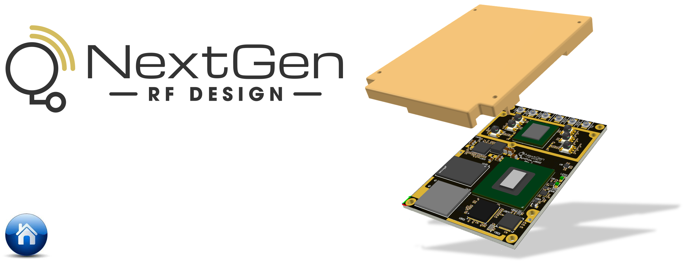
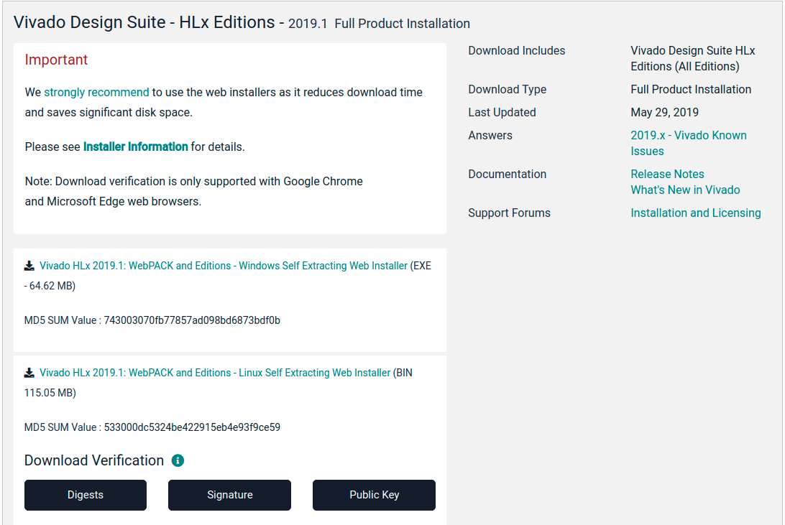

# Build Environment

This document describes the build environment for building the BytePipe SDK components.  NextGen RF Design uses Windows 10 for building the HDL and RFLAN components however they can easily be built using a Linux PC.  The Linux components are built using a Linux PC.  The following sections describe the build environment used by NextGen RF Design along with required dependencies.

# Linux PC

There are many Linux distributions and ways to setup a Linux environment including a dedicated machine, virtual machine, or running on top of Windows.  NextGen RF Design uses Ubuntu 18.04.4 running on a dedicated machine for building the Linux application and drivers.  

To install Ubuntu as the native OS on a PC, download the Ubuntu image which can be found [here](http://old-releases.ubuntu.com/releases/18.04.4/).  It is advised to use [Rufus](https://rufus.ie/) to create a bootable USB drive using this image.  Additional information for installing Ubuntu can be found [here](https://ubuntu.com/tutorials/install-ubuntu-desktop#1-overview).  


Once the Linux system is installed, the following dependencies should be installed as shown below.

```
sudo apt-get update
sudo apt install git
sudo apt-get install build-essential
sudo apt-get install u-boot-tools 
sudo apt install snapd
sudo dpkg-reconfigure dash
```

When running `sudo dpkg-reconfigure dash` select **no** when prompted.  This will disable dash and enable bash.

# Windows PC

For building the HDL on a Windows machine NextGen RF Design uses [Cygwin](https://cygwin.com/install.html).  When installing Cygwin make sure to install the following packages shown below.

```bash
accerciser
alure-utils
checkbashisms
cmake
expect
gcc-tools-epoch2-automake
gnome-python
make
php
ruby
```

# Vivado Design Suite

The Vivado Design Suite from Xilinx must be installed on both the Windows PC and Linux PC.  The Vivado Design Suite includes the Xilinx Eclipse SDK which must be selected during installation.  This repository uses Vivado Design Suite 2019.1.3.  This can be downloaded and installed from [here](https://www.xilinx.com/support/download/index.html/content/xilinx/en/downloadNav/vivado-design-tools/archive.html).  




# Disclaimer
----------------------
NextGen RF Design makes no warranty for the use of this code or design. This code is provided "As Is". NextGen RF Design assumes no responsibility for any errors, which may appear in this code, nor does it make a commitment to update the information contained herein. NextGen RF Design specifically disclaims any implied warranties of fitness for a particular purpose.

Copyright (c) NextGen RF Design. All rights reserved.

