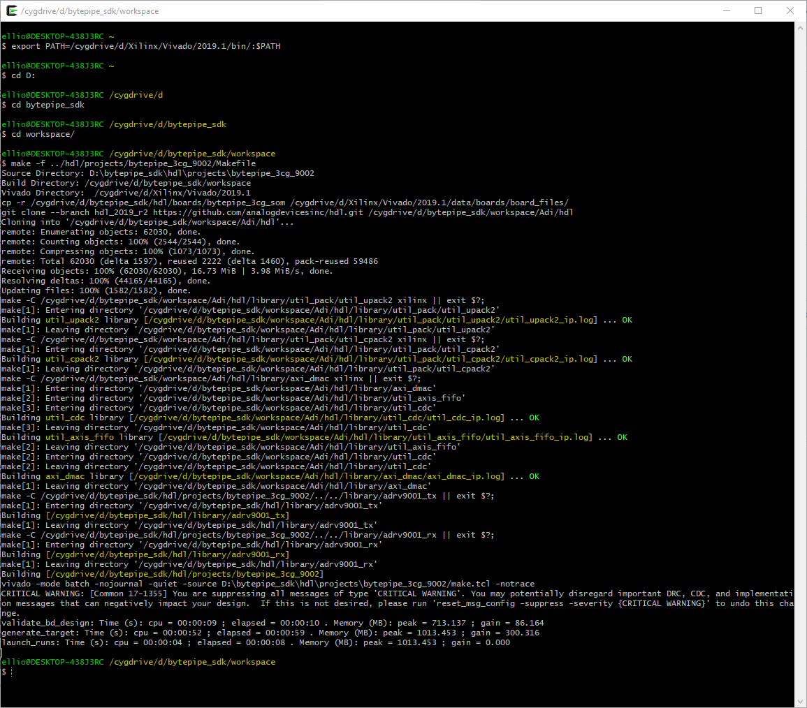

# Building HDL

The HDL build outputs are used for creating a hardware platform and board support package when building the software.  If there is no desire to build the HDL from source the software can be built using the latest HDL build which can be found in the releases folder [here](https://github.com/NextGenRF-Design-Inc/bytepipe_sdk/releases).

Before building the HDL make sure the environment is properly setup.  See [Build Environment](../BuildEnv/BuildEnv.md) for additional information.

The building of the HDL source code involves creating a project using the appropriate integrated development environment (IDE), importing the source fies, and generating the output products.  Only the source files and build scripts need to be maintained in the repository allowing for the project and output products to be generated at any time.  The build script executes all steps from creating a project, building appropriate ip, and generating the final output products.  To invoke the build script one needs to simply issue the "make" command from a bash terminal with the corresponding project path specified.  The current directory from which the script is called will determine the project location.  

The following example uses cygwin to build the HDL.  This example creates a `workspace` folder that will contain the project files and output products.  The source remains in the orignial repository folder.  Once the project is created any source files that are modified will be modified in the original repository where changes can be committed.  The project files and output products will remain in the workspace folder where they can eventually be deleted.  

```
cd D:
git clone https://github.com/NextGenRF-Design-Inc/bytepipe_sdk.git
export PATH=/cygdrive/d/Xilinx/Vivado/2019.1/bin/:$PATH
cd bytepipe_sdk/
mkdir workspace
cd workspace/
make -f ../hdl/projects/bytepipe_3cg_9002/Makefile
```
 
# bytepipe_3cg_9002

The following example builds the `bytepipe_3cg_9002` HDL using cygwin running on Windows 10.



# Disclaimer

NextGen RF Design makes no warranty for the use of this code or design. This code is provided  "As Is". NextGen RF Design assumes no responsibility for
any errors, which may appear in this code, nor does it make a commitment to update the information contained herein. NextGen RF Design specifically
disclaims any implied warranties of fitness for a particular purpose.
Copyright(c) NextGen RF Design
All rights reserved.

