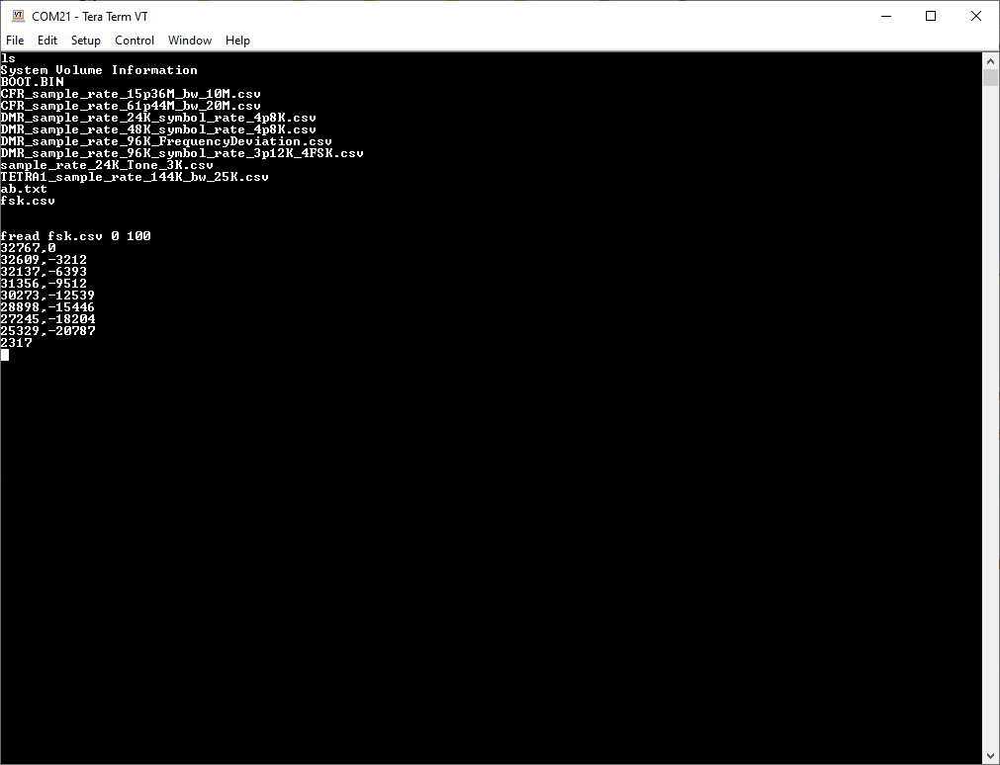
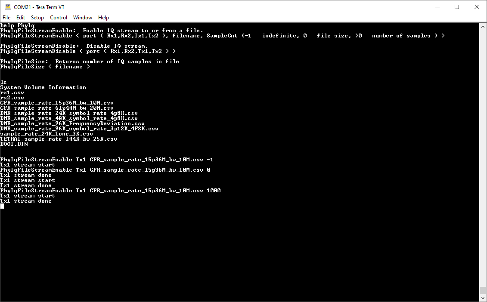

# RFLAN CLI

The RFLAN application supports a custom command line interface (CLI) allowing users to interact with the RFLAN through a serial port and terminal program.  For information on adding custom CLI commands refer to [RFLAN CLI Architecture](../Architecture/Architecture.md#rflcli).

# Hardware Connection

To connect to the RFLAN serial port, plug a USB Micro-B cable into the JTAG & Serial Port connector on the BytePipe HDK.

# Software Connection

To access the RFLAN CLI a serial terminal such as [Tera Term](https://osdn.net/projects/ttssh2/releases/) or [Putty](https://www.chiark.greenend.org.uk/~sgtatham/putty/latest.html) should be installed.  The serial port on the BytePipe HDK will enumerate as a Virtual COM port using the [FTDI USB Driver](https://ftdichip.com/drivers/). Open the terminal program on the PC and connect to the appropriate COM port with the settings shown below.

# Bootup

When the RFLAN is initially booted it will display welcome text followed by the results of the ADRV900x initialization.  The welcome text includes the RFLAN version and instructions for displaying a list of CLI commands.

# Help

Typing `help` displays all the CLI commands available and instructions for using them.  Typing `help` followed by text will display CLI commands that contain the provided text.

# File System

To list the files BOOT partition type `ls`.  Files can be read issuing the `fread` command.  

# Waveform Streaming

The RFLAN application supports streaming of IQ data to and from the file system to the radio.  

# DISCLAIMER

THIS SOFTWARE IS COVERED BY A DISCLAIMER FOUND [HERE](../../DISCLAIMER.md).
